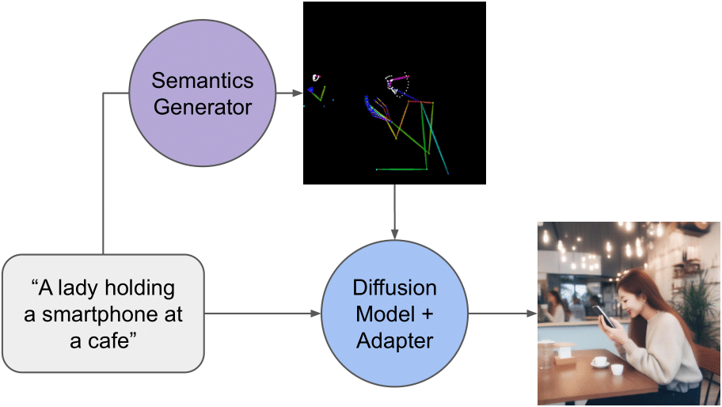
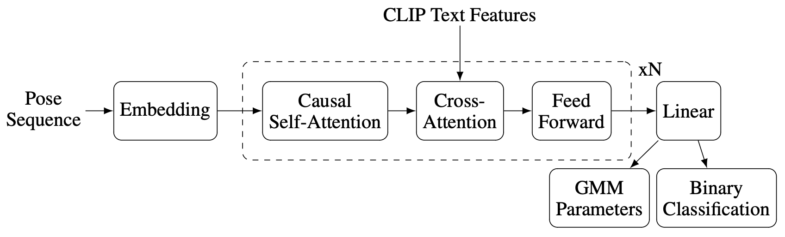
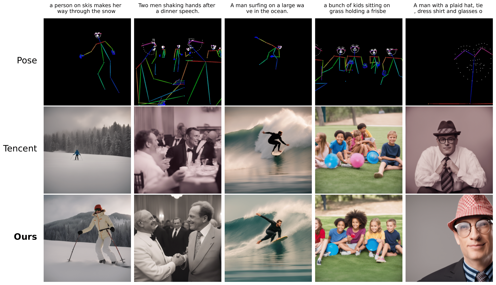

# From Text to Pose to Image: Improving Diffusion Model Control and Quality

- [📝 Link to the paper](https://arxiv.org/abs/2411.12872)
- [🤗 Link to Text-To-Pose model](https://huggingface.co/clement-bonnet/t2p-transformer-v0)
- [🤗 Link to CLaPP (Contrastive Language-Pose Pretraining) model](https://huggingface.co/clement-bonnet/clapp-v0)
- [🤗 Link to Pose Adapter model](https://huggingface.co/clement-bonnet/t2i-adapter-sdxl-dwpose)
- [🤗 Link to created COCO-2017 annotated dataset](https://huggingface.co/datasets/clement-bonnet/coco_val2017_100_text_image_pose)


This repository contains the code for the paper _From Text to Pose to Image: Improving Diffusion Model Control and Quality_, published at the NeurIPS 2024 Workshop on Compositional Learning: Perspectives, Methods, and Paths Forward ([link to workshop](https://compositional-learning.github.io/)).


Standard <em>text-to-image</em> generation             |  Ours: <em>text-to-pose-to-image</em> generation
:-------------------------:|:-------------------------:
  |  

## Text To Pose

<div align="center">
    
    <figcaption>Text-to-pose transformer architecture</figcaption>
</div>


## Pose Adapter

<div align="center">
    
    <figcaption>Generated poses using the Tencent pose adapter and ours</figcaption>
</div>


# Citation

If you use this paper in your work, please cite the paper using the following BibTeX entry:

```bibtex
@misc{bonnet2024textposeimageimproving,
      title={From Text to Pose to Image: Improving Diffusion Model Control and Quality}, 
      author={Clément Bonnet and Ariel N. Lee and Franck Wertel and Antoine Tamano and Tanguy Cizain and Pablo Ducru},
      year={2024},
      eprint={2411.12872},
      archivePrefix={arXiv},
      primaryClass={cs.CV},
      url={https://arxiv.org/abs/2411.12872}, 
}
```
